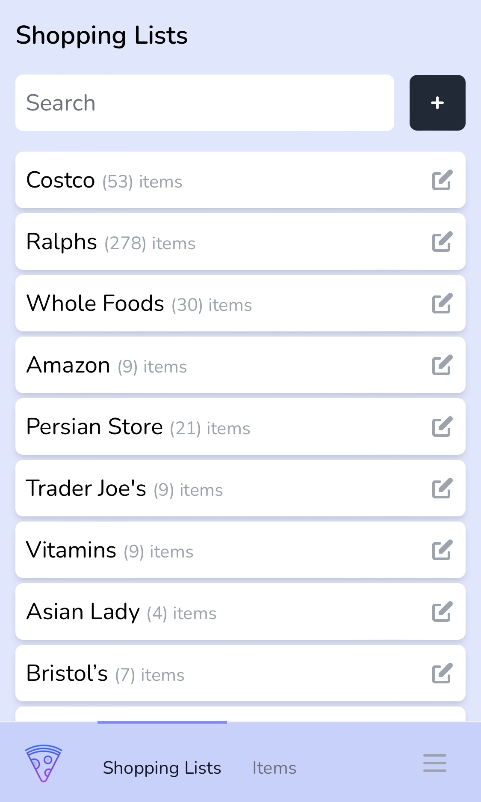
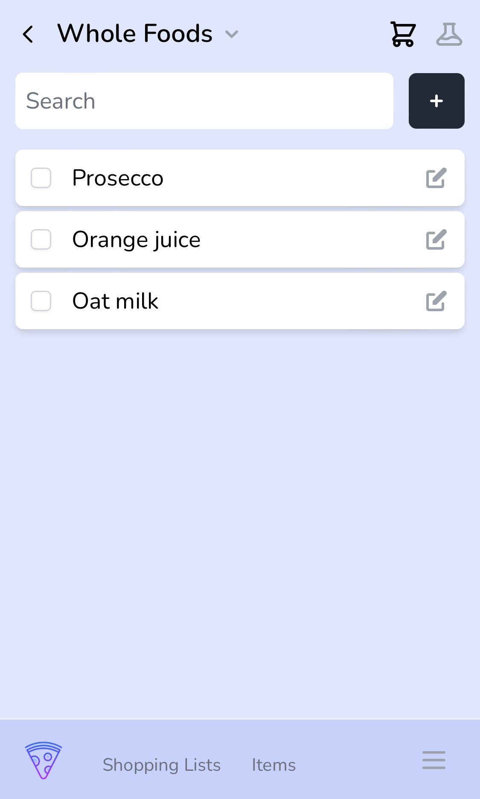
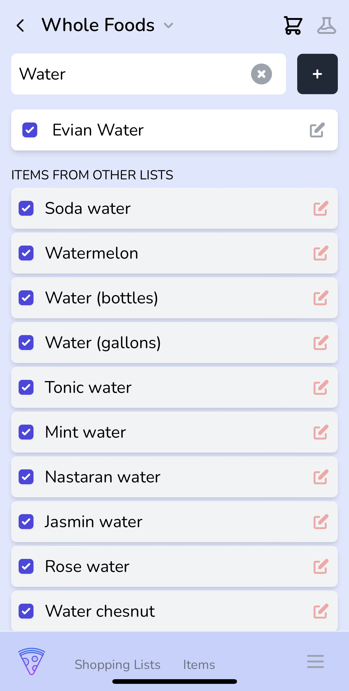
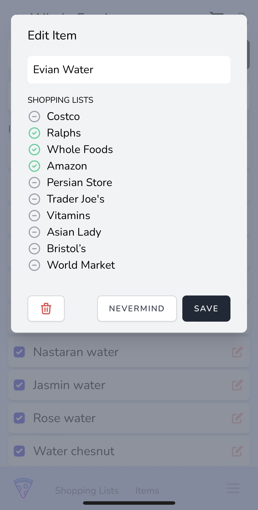

<p align="center"><a href="https://github.com/webrobert/pantry" target="_blank"></a></p>

## About Pantry

I wanted a clean shopping lists app. I was tired of stupid checklists and horrible ux. 
I wanted to be able to add or check off milk or butter from multiple lists.
I wanted to be able to sort items based on where they were in a given store.
All while both my sweetheart, and I could manage shared lists and/or shop.

Pantry is made with Livewire as an experiment. 
I think some frontend javascript-AplineJs maybe-could make it feel a little more peppy. 
The draggable sorting needs work. It has issues on mobile. 
Go easy. I wrote it over a weekend. 
She loves it. And we use it for our shopping.

### Purpose of the app
- Simple easy to use UX.
- Work on mobile or from a desktop
- Visually clean
- Sortable individual lists

### Future Ideas

- I've thought about wiring Pantry up to stores to place online orders. 
In the USA Kroger is a major Grocer. And,
- I started playing with their api to get product information. 
- Along those lines, I imagined we could also use Pantry as a virtual pantry to see what we currently have and wehn it expires.
- Lots of potential..
- I used Jetstream thinking the team feature would be useful to share lists. At present, it's not using teams to separate his/her team lists. 
We've just been using one set of credentials and that has worked fine. 


### Screenshots

<p align="center"></p>
<p align="center">Simple searchable list view</p>

<br>
<p align="center"></p>
<p align="center">Same simple searchable shopping list view.</p>

<br>
<p align="center"></p>
<p align="center">Search for items in the list and also find items in other lists.</p>

<br>
<p align="center"></p>
<p align="center">Edit an item and its related lists.</p>


## Installing Pantry

Do the typical Laravel commands... composer install and what not. 

Then you can just run...

```zsh
 php artisan migrate --seed
```

This runs the [`DatabaseSeeder.php`](/database/seeders/DatabaseSeeder.php)
which creates a few things...
1. a default user... `test@example.com`, and password `password` (the app doesn't allow registration. It's meant to be a personal app).
2. a few default lists via [`ShoppingListSeeder.php`](/database/seeders/ShoppingListSeeder.php) 
3. items related to the default lists. These items are text files. I copy/pasted from my Apple notes checklists. The seeder parses them properly for this use case.

> 💡 **Bonus** (maybe): If you happen to have some Apple Notes checklists you can create text files in the [/database/items](/database/items) directory. 
And as long as the textfile name matches a corresponding list name in [`ShoppingListSeeder.php`](/database/seeders/ShoppingListSeeder.php) the items will also be added to the correct lists.
## Contributing

Thank you for considering contributing to Pantry. 
It was just a pet project. So it's far from perfect. 
And I am completely open to improvements, etc.
